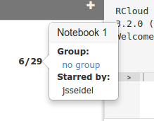

# {{page.title}}

Created: 2015-07-03. RCloud documentation is currently maintained by <a target="_blank" href="http://www.spencerseidel.com">Spencer Seidel</a> on a voluntary basis.

## Table of Contents

1. [Functional Enhancements](#functional)
  * [Protected Notebooks](#protectednotebooks)
  * [Remote Instances](#remoteinstances)
  * [Cell Execution](#cellexecution)
  * [Binary Assets](#binaryassets)
  * [Header Bar Customization](#headerbarcustomization)
  * [Notebook Prefix](#notebookprefix)
1. [GUI Enhancements](#gui)
  * [Toggle Results](#toggleresults)
  * [Hiding UI Elements](#hideuielements)
  * [Cell States](#cellstates)
  * [Multi-Line Command Input](#multilinecommandinput)
  * [HTML Syntax](#htmlsyntax)
1. [Technical Enhancements and Notes](#tech)
  * [Workspace Panel](#workspacepanel)
1. [Plugins](#plugins)
  * [Workspace Viewer](#workspaceviewer)
1. [Bug Fixes](#bugfixes)

[Top](#top)

<a name="functional" />

## Functional Enhancements

<a name="protectednotebooks" />

### Protected Notebooks

Protected notebooks are readable only by the owner and (optionally) a select group of users and will not show up in search results (although previously unprotected versions might).

View or modify notebook protection by clicking the notebook "info" button next to the notebook name in the notebooks tree:

If you own the notebook, click the "no group" link (or a group name if one exists):

This opens the notebook protection dialog:

Here, you can assign the notebook to any group you are a member of or make it entirely private (readable only by you).

Use the second tab of the protection dialog to create/rename groups and/or assign other users as administrators/members of groups you administrate.

[Top](#top)

<a name="remoteinstances" />

### Remote Instances

View notebooks stored on other git/GitHub-based RCloud instances by configuring RCloud with multiple `gist.source` names. Specifying a name in a notebook URL (`&source=name`) loads the notebook from another instance. Search has an option to search all sources.

In this release, all notebooks are displayed in the same notebook tree. Non-local notebooks are displayed in green and are read-only. You can, however, fork and star non-local notebooks. Commenting is disabled for non-local notebooks.

[Top](#top)

<a name="cellexecution" />

### Cell Execution

Clicking the stop button in the header bar sends an interrupt to the R process and terminates execution if possible.

[Top](#top)

<a name="binaryassets" />

### Binary Assets

Assets can be binary (i.e. not text based). RCloud auto-detects content format and transparently encodes and decodes using base-64 encoding. When possible, the content is displayed in its native format in the asset panel (e.g. images). Asset size is limited to 750KB.

[Top](#top)

<a name="headerbarcustomization" />

### Header Bar Customization

Header bar menus are customizable in order to display, for example, help or other resources in the area around the Advanced menu.

[Top](#top)

<a name="notebookprefix" />

### Notebook Prefix

New RCloud notebook names default to "Notebook" in the root of your user ID notebook tree. Use the Notebook Prefix setting to change the prefix for new notebooks. For example, change this setting to put all new notebooks in a particular folder.

[Top](#top)

<a name="gui" />

## GUI Enhancements

<a name="toggleresults" />

### Toggle Results

When cell output is long and it's difficult to find the next cell, you can toggle the results of individual cells.

[Top](#top)

<a name="hideuielements" />

### Hiding UI Elements

Use `&quiet=1` in view.html notebook URLs to hide all UI elements, including cell-status.

[Top](#top)

<a name="cellstates" />

### Cell States

If you change a cell after it is enqueued to run, the state of the cell will turn into a purple question mark:

This indicates that the result after running may not be in sync with the newly modified code in the cell. When the cell runs, RCloud displays a spinning question mark:

After the cell runs, the status will change to the "ready" state instead of the complete state (a solid green circle):

This indicates that the cell needs to run again for the modified code and displayed results to sync.

[Top](#top)

<a name="multilinecommandinput" />

### Multi-Line Command Input

Multi-line command input is indicated with a `+` to emulate command-line R.

[Top](#top)

<a name="htmlsyntax" />

### HTML Syntax

RCloud highlights and checks HTML syntax.

[Top](#top)

<a name="tech" />

## Technical Enhancements and Notes

<a name="workspacepanel" />

### Workspace Panel

The workspace panel is not updated if it is closed.

[Top](#top)

<a name="plugins" />

## Plugins

<a name="workspaceviewer" />

### Workspace Viewer

* The dimensions of the data frames are shown in the overview.
* Function arguments are shown without the preceding function keyword to save space.

[Top](#top)

<a name="bugfixes" />

## Bug Fixes

* In OS X, Ctrl-A and Ctrl-E positions the curser at the beginning and end of the current line and not the wrapped line.
* Improved markdown formatting.
* Leaving a text-field setting commits the change. Esc still cancels and Enter still commits.
* RCloud doesn't hang after multiple sequential password prompts.
* RCloud doesn't allow empty notebook folders.
* Python errors are detected by the notebook, which display correct status and cancel execution.
* Empty Python cells do not hang RCloud.
* RCloud restores error messages (e.g. notebook not published) in view mode.
* Tagged versions of notebooks are available in view mode.
* Special HTML characters (e.g. `Press <enter> to continue`) are displayed correctly in text input prompts.
* Help with R 3.2.0 is working as expected.
* Forked notebooks within folders are not given the same name as the originals.
* Text input prompts are not truncated in view mode.
* Redirects through the login page return to the same page that was requested. Note that custom login pages should take `&redirect=<URL>` as a query parameter and POST the same value to login.R when submitting the username and password.
* Messages between client and server are not fragmented and do not cause connectivity issues.
* RCloud properly displays equations in RMarkdown cells.
* Clicking a scrolled cell positions the cursor at the intended line.
* RCloud does not display an oversized left margin for markdown. 

[Top](#top)
