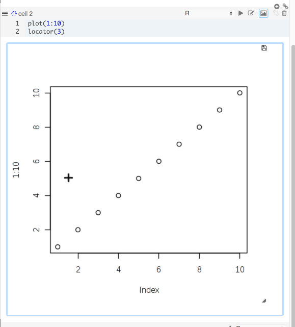
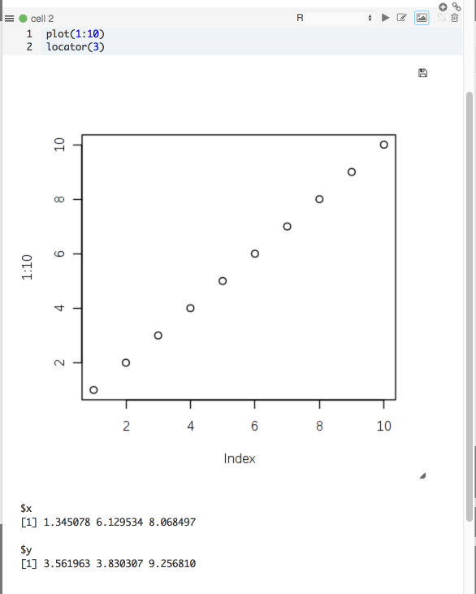
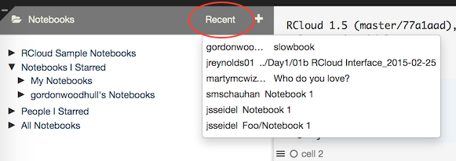

# {{page.title}}

Created: 2015-10-14. RCloud documentation is currently maintained by <a target="_blank" href="http://www.spencerseidel.com">Spencer Seidel</a> on a voluntary basis.

## Comprehensive Documentation

Please see [1.5 Current GUI Documentation](/rcloud/doc/1.5/guidoc/doc.html) for comprehensive documentation of the RCloud GUI, including the new features below.

## Table of Contents

1. [Functional Enhancements](#functional)
  * [Flush](#flush)
1. [GUI Enhancements](#gui)
  * [Locator](#locator)
  * [Recent Notebooks](#recentnotebooks)
  * [Shell Cells](#shellcells)
1. [Technical Enhancements and Notes](#tech)
  * [RCloud Root](#root)
  * [User Extensions](#userextensions)
  * [Error Messages](#errormessages)
1. [Bug Fixes](#bugfixes)

[Top](#top)

<a name="functional" />

## Functional Enhancements

<a name="flush" />

### Flush

`rcloud.flush.plot()` allows explicit finalization of a plot. This is useful in loops, where RCloud cannot automatically detect when a plot has been finalized or when plot output is combined with other output. `rcloud.flush.plot()` is called automatically after cell execution.

[Top](#top)

<a name="gui" />

## GUI Enhancements

<a name="locator" />

### Locator

`locator()` is supported, enabling point+click R tools such as `identify()`. When the locator is active, RCloud adds a blue border around a plot and changes the cursor to a crosshair:

To add points, left-click on the plot. To end/abort a locator request, press the &lt;ESC&gt; key. Once you have selected your locations, RCloud displays them below the plot:

This functionality is only available in R cells.

[Top](#top)

<a name="recentnotebooks" />

### Recent Notebooks

Access recent notebooks via the Recent link in the Notebooks titlebar:

[Top](#top)

<a name="shellcells" />

### Shell Cells

Shell cells are supported. Each cell represents a separate Unix shell, so environment variables cannot be passed across shell cells. However, R environment variables defined in R cells are inherited by shell cells automatically. Commands are executed in bash.

[Top](#top)

<a name="tech" />

## Technical Enhancements and Notes

<a name="root" />

### RCloud Root

RCloud user home directories are configurable using the `rcloud.user.home` configuration directive in `rcloud.conf`. Use the `rcloud.home()` function to correctly retrieve user home directory paths.

[Top](#top)

<a name="userextensions" />

### User Extensions

The `rcloud.alluser.addons` rcloud.conf key controls all user extensions. This allows multiple RCloud instances to use the same RCS instance with different settings.

[Top](#top)

<a name="errormessages" />

### Error Messages

Bad notebook source triggers a proper error message.

[Top](#top)

<a name="bugfixes" />

## Bug Fixes

* Invalid gist back-end tokens trigger a reauthentication.
* Large assets are supported.
* Conversion of encrypted notebooks with binary assets to public does not fail on public GitHub.
* The asset panel is immediately resized when a column is resized.
* Second control-a positions the cursor at the absolute beginning of a line on Macs.
* Empty and blank group names are not accepted.
* Promoting protected group user from member to admin retains membership.
* Find and replace does not make read-only notebooks appear writeable.
* RCloud makes correct requests for /vector and /[object%20Object].
* Foreign notebooks can be opened in GitHub from view mode.
* Large images do not overlap other panes in the asset viewer.
* Long names do not escape the notebook-info popover.
* The settings panel scrollbar behaves normally.
* Spaces are not retained at the end of Disable and Enable Extensions options and therefore do not cause errors.
* Closing the Manage Groups dialog does not trigger odd messages.
* Types in the workspace panel do not result in bad line breaks.
* Clipboard copy does not add text to the end of the page in view mode.
* Locator and rcloud.html.out flush plots immediately when invoked.

[Top](#top)
